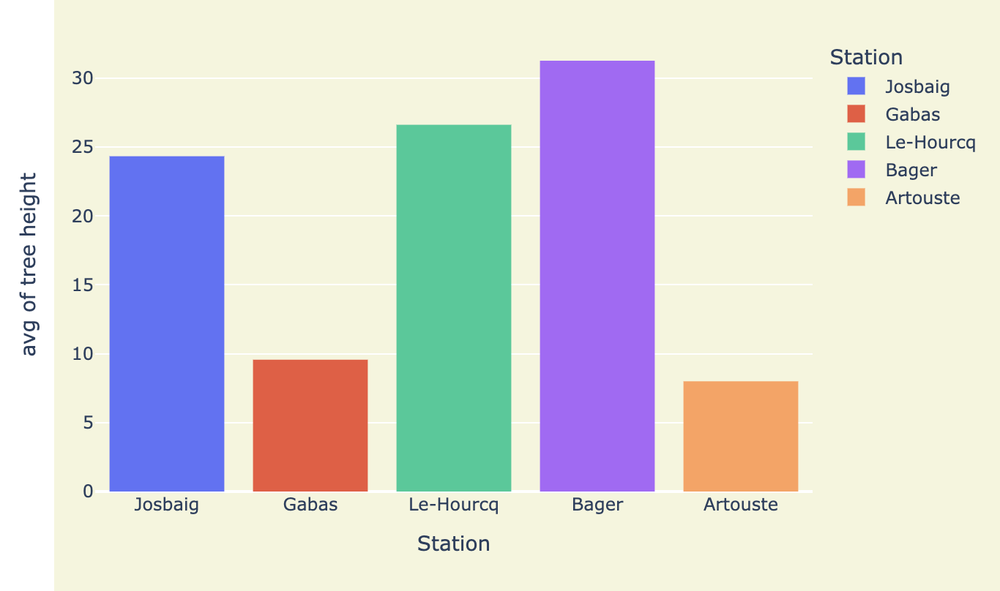
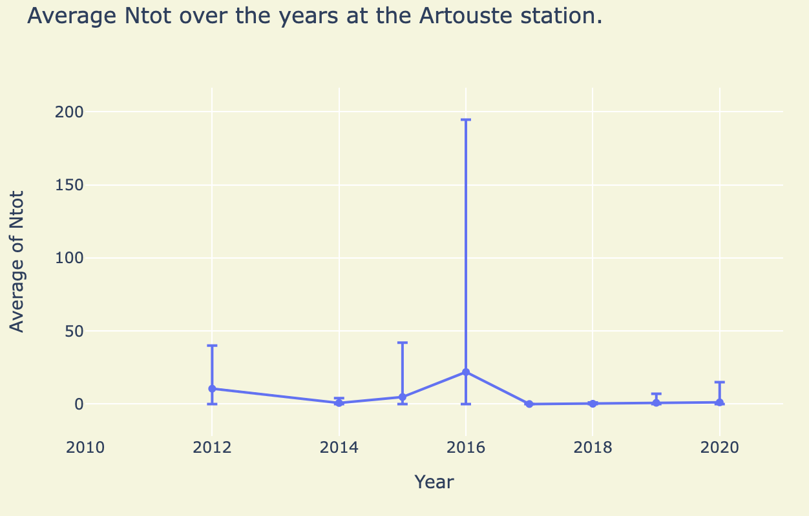
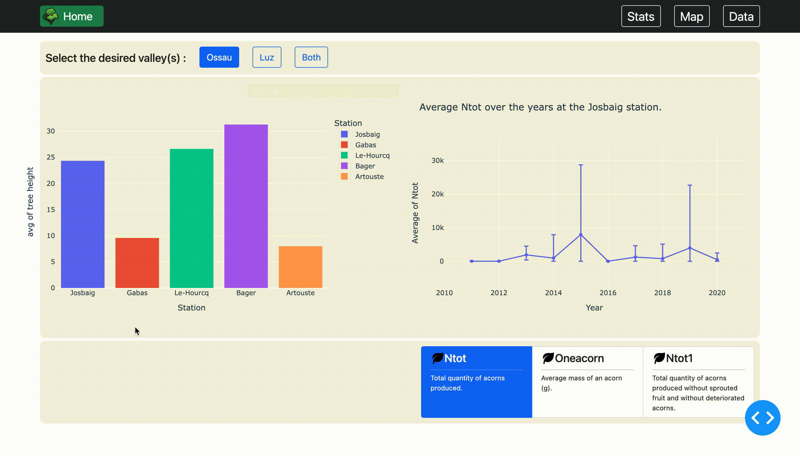
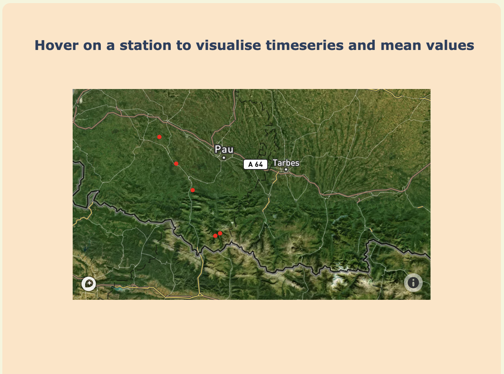
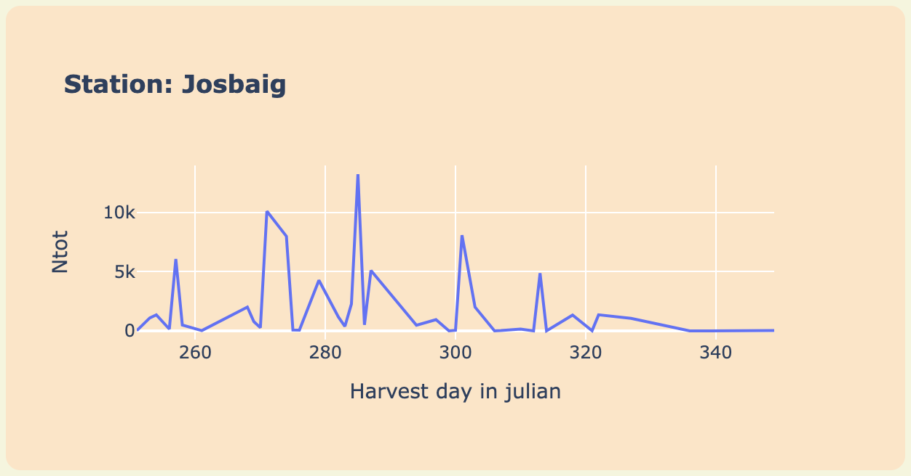
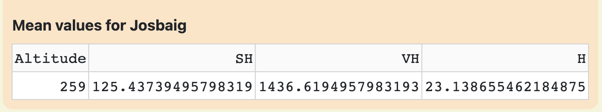

<div id="top"></div>

<!-- PROJECT LOGO -->
<br/>
<div align="center">
  <a href="https://uf-mi.u-bordeaux.fr/sites/cmi-isi/">
    
  </a>

  <h3 align="center">CMI ISI project</h3>

  <p align="center">
    Authors: Alexandre Leys and Hamad Tria
  </p>
</div>


<!-- TABLE OF CONTENTS -->
<details>
  <summary>Table of Contents <strong></summary>
  <ol>
    <li>
      <a href="#about-the-project">About The Project</a>
      <ul>
        <li><a href="#built-with">Built With</a></li>
      </ul>
    </li>
    <li>
      <a href="#getting-started">Getting Started</a>
      <ul>
        <li><a href="#prerequisites">Prerequisites</a></li>
        <li><a href="#installation">Installation</a></li>
      </ul>
    </li>
    <li>
      <a href="#usage">Usage</a>
      <ul>
        <li><a href="#stats">Stats</a></li>
        <li><a href="#map">Map</a></li>
      </ul>
    </li>
  </ol>
</details>


<!-- ABOUT THE PROJECT -->
## About The Project

This project revolves around a data set regarding the Quercus tree species. A group of researchers collected this data, our job was to help interpret and visualize it.

These were our three work axes:
* Creating a coherent database from the .csv file
* Choosing the most relevant variables sets to work with 
* Illustrating the data with interactive figures

This project uses the MVC (Model-View-Controller) pattern. This "separation of concerns" provides for a better division of labor and improved maintenance in the long term.

<p align="right">(<a href="#top">back to top</a>)</p>


### Built With

These are the main frameworks/libraries used for the project.

* [Sqlite](https://www.sqlite.org/)
* [plotly.express](https://plotly.com/python/plotly-express/)
* [Dash](https://plotly.com/dash/)
* [Pandas](https://pandas.pydata.org/)

<p align="right">(<a href="#top">back to top</a>)</p>


<!-- GETTING STARTED -->
## Getting Started

To get a local copy up and running follow these steps.

### Prerequisites

If not already done install Dash
* Dash
  ```sh
  pip3 install dash
  ```
Also, if not already done install dash_extensions for gif like animations
* Dash_extensions
  ```sh
  pip3 install dash_extensions
  ```

### Installation

To install and set up the app:

1. Clone the repo
   ```sh
   git clone https://github.com/HamadTria/Projet-de-programmation-CMI
   ```
2. Place yourself at the dashapp.py root

3. Run dashapp.py
   ```sh
    python3 dashapp.py
   ```

<p align="right">(<a href="#top">back to top</a>)</p>


<!-- USAGE EXAMPLES -->
## Usage

Once the app is up and running, you can visit the <a href="http://127.0.0.1:8050/">website.</a>

There are three pages accessible through the menu bar:

* <a href="http://127.0.0.1:8050/stats">Stats</a>
* <a href="http://127.0.0.1:8050/map">Map</a>
* <a href="http://127.0.0.1:8050/data">Data</a>


### Stats

This page has two interactive figures, a bar chart on the left and an error bar chart on the right.




The bar chart shows the tree height avarege per station. By hovering on a station bar, the graph on the right refreshes.



The error bar chart on the right shows the average Ntot value over the years. For each year, the error bar indicates the min, max, and mean values of Ntot for that year.

Thank to the button-group in the bottom right, one can change between Ntot, Oneacorn and Ntot1.


### Map

This page illustrates a geographique representation of the stations. 



The map is interactive. The time-series graph and the mean-values-table refresh accordingly by hovering on a station.


The time-series graph shows the evolution of the Ntot value with respect to the harvest day.



The mean-values table gives the average figures for the chosen station.



<p align="right">(<a href="#top">back to top</a>)</p>